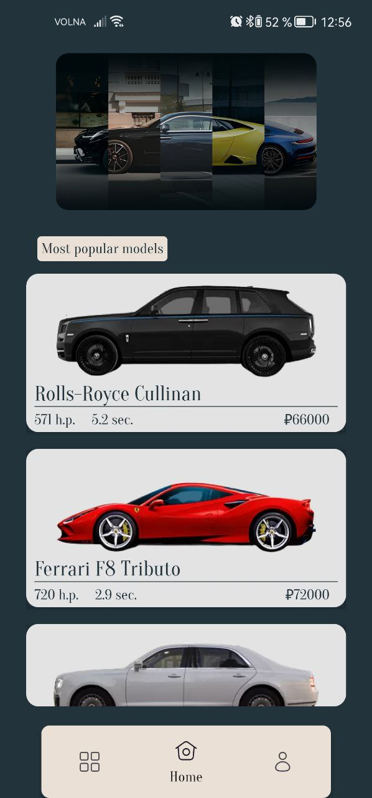
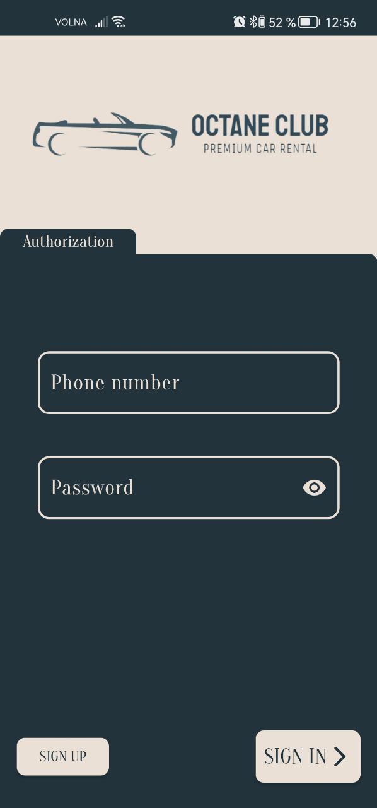
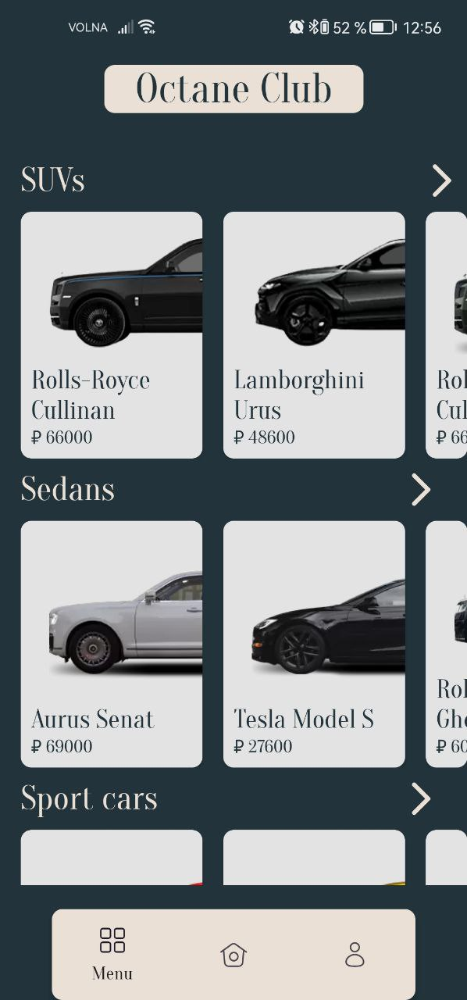
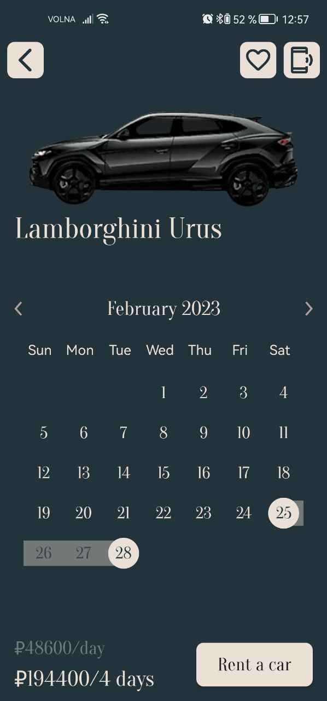

# Car Rental - car rental application concept

## About 

Car rental is an application concept for a car rental company. You can order a car, view a list of available cars, add cars to your favorites list, and so on.

## Screenshots

    
    
    
    

 

## Technical stack 
- Kotlin
- SQLite
- Picasso
- [ImageSlideShow](https://github.com/denzcoskun/ImageSlideshow)
- [CalendarDateRangePicker](https://github.com/ArchitShah248/CalendarDateRangePicker)
- [MaskedEditText](https://github.com/santalu/maskara)
- [ShapedImageView](https://github.com/siyamed/android-shape-imageview)
